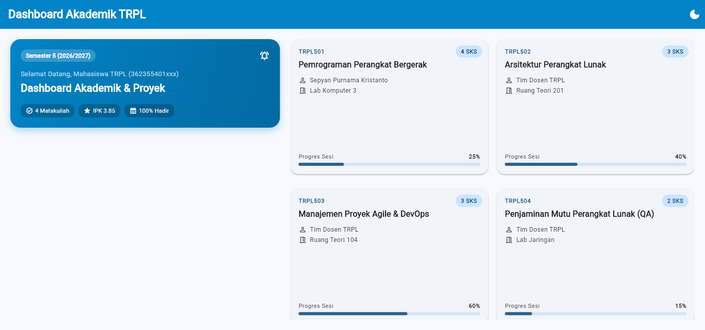

# Laporan Praktikum Modul 02: Declarative UI & Responsive Layout

- **Nama**: [Afifa Nur Fitria]
- **NIM**: [362558302034]
- **Kelas / Prodi**: 3C / Sarjana Terapan TRPL
- **Mata Kuliah**: Pemrograman Perangkat Bergerak (Semester 3)

---
## 1. Ringkasan Implementasi
Saya membuat Dashboard Akademik responsif pakai `LayoutBuilder`—menampilkan `ListView` 1 kolom di layar mobile dan `GridView` 2 kolom di layar lebar. Tampilannya pakai tema Material 3 (*Light/Dark Mode*), dilengkapi filter `ChoiceChip`, hitungan total SKS dinamis di header, dan detail matkul via `showModalBottomSheet`.

## 2. Bukti Tangkapan Layar (Running App)
| Mode Portrait (Light) | Mode Dark Theme | Mode Landscape / Tablet (2 Kolom) |
|---|---|---|
|  |  |  |

## 3. Kendala Layout yang Dihadapi & Solusinya
- **Kendala**: Terjadi *overflow/unbounded height* saat memasukkan `ListView`/`GridView` ke dalam `SingleChildScrollView`.
- **Solusi**: Menambahkan `shrinkWrap: true` dan `physics: const NeverScrollableScrollPhysics()` pada `ListView`/`GridView`.

## 4. Jawaban Pertanyaan Refleksi
1. **Efisiensi Single-pass BoxConstraints**: Flutter cuma butuh satu kali alur kalkulasi ukuran dari parent ke child, jadi proses render layout sangat cepat tanpa perlu hitung ulang berulang kali.
2. **Kriteria Modularisasi Widget**: Dipisah jadi widget tersendiri kalau kodenya mulai panjang, kompleks, atau bakal dipakai berulang kali biar kodenya tetap rapi dan gampang di-maintain.
3. **Manfaat M3 ThemeData Terpusat**: Bikin gaya warna dan font seragam di seluruh aplikasi, serta mempermudah switch *Light/Dark Mode* secara otomatis tanpa ubah kode per widget.